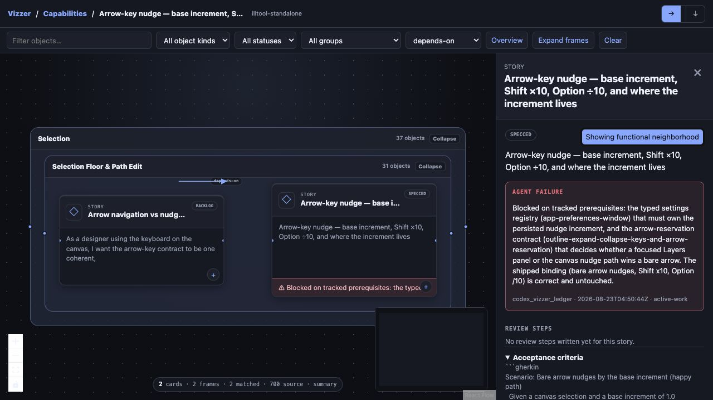
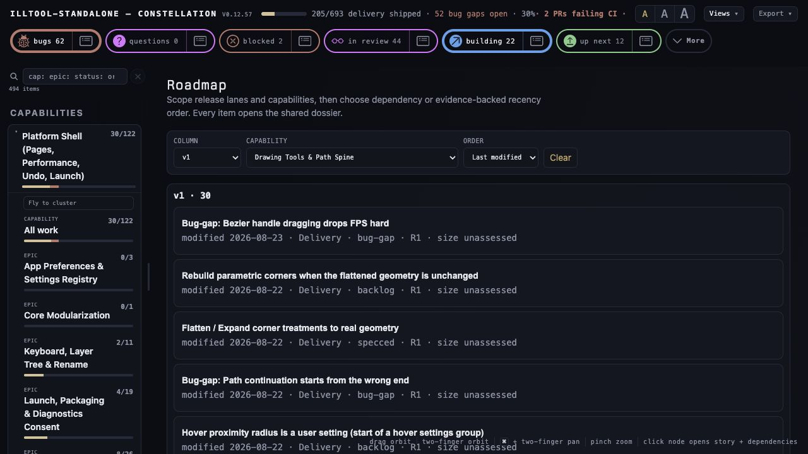

# IllTool React Flow prototype findings

> Goal: [G-002 — Developer-experience object graph](../../developer-experience-object-graph.md)
> Captured: 2026-08-23
> State: working IllTool prototype on `codex/vizzer-react-flow`; upstream core not yet integrated

## What the prototype proved

- Highest level: 19 capability frames over a 700-object, 114-group source graph, with aggregated
  cross-capability dependencies.
- Capability focus: Drawing Tools & Path Spine reveals its immediate functional clusters while
  retaining collapsed external dependency capabilities.
- Functional-cluster focus: stories become rich cards inside the authored nested frame hierarchy.
- Story focus: the selected story plus direct prerequisites, consumers, and typed neighbors form a
  bounded functional neighborhood.
- Aggregate frames expose blocked/failed, active, ready, and shipped descendant counts.
- Story cards and the right dossier consume `vizzer-story-detail/v1`, shared with Constellation's
  section extractor rather than rediscovering Review steps, Acceptance, and DoD.
- ELK supplies orthogonal compound routes. A named test reports no unrelated-card intersections in
  its fixture and detects a deliberately mutated route through a card.
- The optional bundle is offline and disabled by default in an installed project. Core rendering
  returns before reading React/ELK assets when disabled.

This screenshot is provenance-bearing rather than decorative: the selected story's failure strip
and dossier cite the actual agent, timestamp, message, and `active-work` source. The relationship
filter is active, two nested authored frames remain visible, and the source/mounted split reads
`2 cards · 2 frames · 2 matched · 700 source`.

## Related view-query finding

The same prototype added Roadmap scope by release column and capability, plus Default, Dependency,
and Last modified order. Filter ids survive a reload in the hash. `Last modified` reads normalized
`last_touched`; missing evidence says `unknown` and sorts last.

## Scale receipt and honest limit

A deterministic 10,000-object corpus with more than 19,000 relations normalizes under the named
10-second falsifier and advertises a 600-card materialization cap. React Flow also uses visible-only
DOM rendering. That supports the interaction architecture, not a blanket Salesforce claim.

The standalone HTML still contains the complete normalized source payload. At 100,000 objects this
becomes a transfer/parse problem even if only 600 React cards mount. Upstream scale work therefore
still needs indexed/chunked adapters and served neighborhood queries; merely raising the cap would
be the sort of solution a space heater might propose.

## Upstream extraction boundary

Promote these project-neutral seams, not IllTool's fixture vocabulary:

1. schema-1 objects/relations/groups/vocab/limits/provenance validator;
2. shared story/object detail payload;
3. semantic focus state and view-query route ids;
4. ELK layout/routing contract and route-overlap falsifier;
5. optional pinned build with separate MIT/EPL notices;
6. adapters for code, metadata, SaaS, database, and work graphs.

## Adversarial review outcome

The review found six concrete defects and they were fixed in the IllTool
prototype: unusable global camera fit, an invalid nested edge marker, quadratic
object lookup during relation conversion, hidden relationship labels, dossier
title overlap over the story-focus action, and a minimap that broke the visual
theme.

Residual risks remain part of G-002 rather than being waved through:

- standalone full-graph/full-dossier payloads do not meet the enterprise-scale
  target;
- current relation projection scans the complete edge set;
- the two views share a detail schema but not one rendered detail component;
- Roadmap filters persist in their route but do not yet compose into a universal
  cross-view query;
- the current scale receipt proves 10,000-object normalization, not 100,000-object
  browser interactivity.
