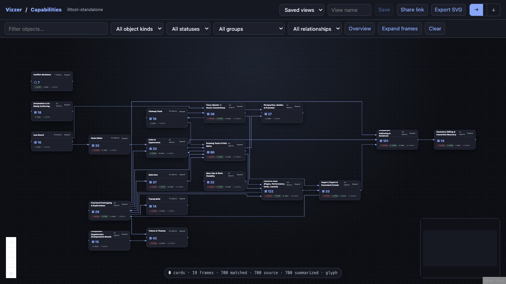
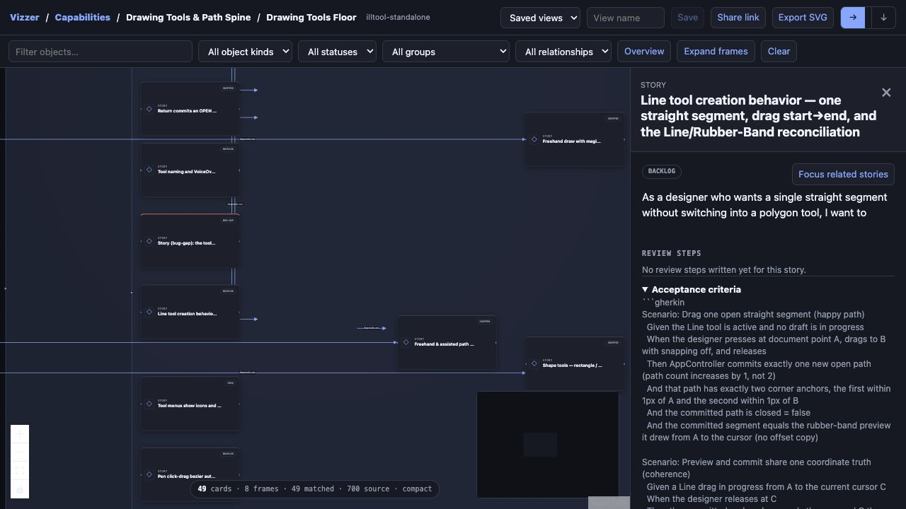
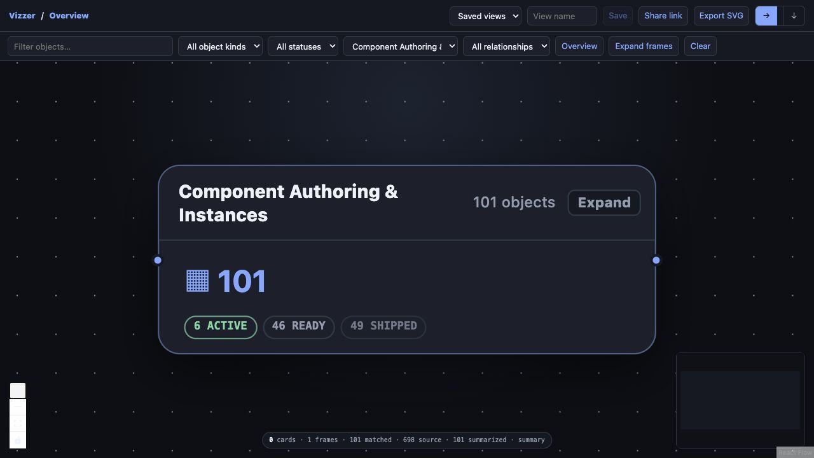
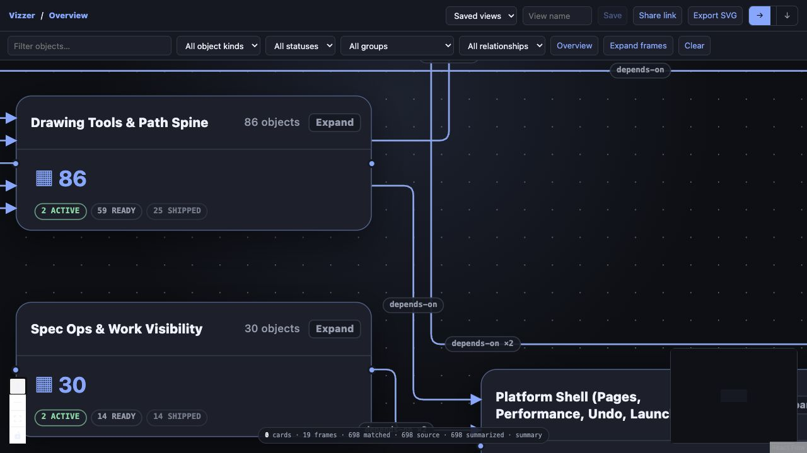
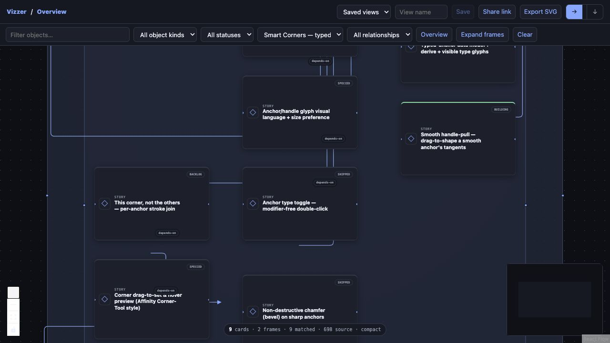

# Upstream developer-flow verification — 2026-08-23

## Verified behavior

- The optional renderer ships pinned React 18.3.1, React Flow 12.11.3, and ELK 0.11.1 as one
  precompiled, offline asset with retained MIT/EPL notices. It is disabled by default and adds no
  Node or React runtime requirement to core Vizzer.
- Two unrelated neutral fixtures—a web application and a data pipeline—exercise arbitrary object,
  relation, and grouping vocabularies through the same schema.
- Capability overview, nested group drill-down, story functional neighborhood, status composition,
  shared dossier detail, orthogonal routed edges, filters, saved views, URL views, and SVG export are
  covered by focused tests and a real browser exercise.
- Frame and card geometry grows from wrapped title/summary/failure content instead of fixed header
  assumptions. The reported `Component Authoring & Instances` failure was reproduced at review
  zoom and verified unclipped after the fix.
- Orthogonal bends use a 10-unit quadratic corner radius. ELK reserves 18 units between parallel
  routes; the fan-out regression fixture produces three adjacent lanes at x=204, 222, and 240.
- Relationship labels render in an explicit layer above routes with a fully opaque panel-colored
  mask and four-unit halo, so cables stop visually before the text. SVG export emits the same
  contract as a rounded background rect before each centered label, and includes even deliberately
  wide label bounds in the export viewport rather than clipping them.
- Roadmap filters include release column, capability/product facet, last-modified order, and
  dependency order.
- A synthetic 25,000-object/10-group graph normalized, indexed, and returned a bounded 600-of-2,500
  group slice within the 25-second test budget. The result included a next cursor, exact omission
  counts, and an exact encoded byte count under the 4 MiB response ceiling.
- The schema rejects more than 100,000 objects, 400,000 relations, or 20,000 groups. That is a
  documented safety ceiling, not a boast that arbitrary Salesforce metadata is magically readable.
  A Salesforce adapter should map and aggregate metadata into capability/group slices rather than
  spray the entire org onto one canvas.
- An adversarial 100,000-object/100-group run also returned a bounded 600-of-1,000 group slice in
  617,362 bytes, but cold normalization/indexing took 21.765 seconds and peaked near 1.0 GB RSS.
  The query boundary is sound; the startup/memory profile is not yet an enterprise-performance
  claim. Persisted or incremental indexing is required before using that language.

## Browser receipts

The browser saved and restored a named “Commerce component map”, copied a URL-encoded story view,
and exported [`upstream-neutral-commerce-component.svg`](upstream-neutral-commerce-component.svg).
The SVG is well-formed XML, contains 15 routed relation groups and 15 object groups, and has SHA-256
`6c9ad279394c290c89d42f21060fb269e38d2a9e47a5a2a388f194d7032bfd9d`.

Named saves and copied links are origin-scoped. When Vizzer is served with the default ephemeral
port, the UI now warns that `server.port` must be set to a nonzero value for restart-stable links and
browser storage.

## Automated result

- Focused review/developer-flow suite: **68 passed in 26.31s** on Python 3.9.
- Complete combined upstream suite: **453 passed, 2 skipped in 89.94s** on Python 3.9.
- `npm run build`: passed.
- `npm audit --omit=dev`: 0 vulnerabilities.

The final publication audit supersedes these intermediate counts; this record retains them as the
evidence for the original Developer Flow slice.

Final combined publication audit: **488 passed, 2 skipped in 99.08s** on Python 3.9. The optional
frontend rebuilt successfully; its production dependency audit reported zero vulnerabilities; the
wheel, source distribution, and deterministic zipapp built and validated.

Post-review geometry audit: **126 focused tests passed in 44.17s**. The first complete run was
**487 passed, 2 skipped with one expected Constellation golden identity drift** after bundle bytes
changed; the golden was regenerated from the tested renderer and the CLI/golden slice then passed
**43/43**. The final complete rerun against the settled source identity passed **488 tests with 2
skipped in 83.04s**.

Post-label-occlusion audit: the focused Developer Flow contract passed **14/14** before the golden
identity refresh; the settled complete rerun passed **489 tests with 2 skipped in 67.20s**. The
frontend rebuilt successfully and its production dependency audit again reported zero
vulnerabilities. A live IllTool browser review exercised 12 labeled routes in the nine-story Smart
Corners cluster at readable zoom.
