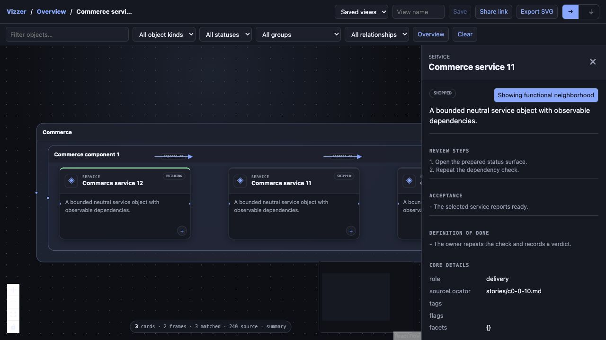

# Upstream developer-flow verification — 2026-08-23

## Verified behavior

- The optional renderer ships pinned React 18.3.1, React Flow 12.11.3, and ELK 0.11.1 as one
  precompiled, offline asset with retained MIT/EPL notices. It is disabled by default and adds no
  Node or React runtime requirement to core Vizzer.
- Two unrelated neutral fixtures—a web application and a data pipeline—exercise arbitrary object,
  relation, and grouping vocabularies through the same schema.
- Capability overview, nested group drill-down, story functional neighborhood, status composition,
  shared dossier detail, orthogonal routed edges, filters, saved views, URL views, and SVG export are
  covered by focused tests and a real browser exercise.
- Roadmap filters include release column, capability/product facet, last-modified order, and
  dependency order.
- A synthetic 25,000-object/10-group graph normalized, indexed, and returned a bounded 600-of-2,500
  group slice within the 25-second test budget. The result included a next cursor, exact omission
  counts, and an exact encoded byte count under the 4 MiB response ceiling.
- The schema rejects more than 100,000 objects, 400,000 relations, or 20,000 groups. That is a
  documented safety ceiling, not a boast that arbitrary Salesforce metadata is magically readable.
  A Salesforce adapter should map and aggregate metadata into capability/group slices rather than
  spray the entire org onto one canvas.

## Browser receipts

The browser saved and restored a named “Commerce component map”, copied a URL-encoded story view,
and exported [`upstream-neutral-commerce-component.svg`](upstream-neutral-commerce-component.svg).
The SVG is well-formed XML, contains 15 routed relation groups and 15 object groups, and has SHA-256
`6c9ad279394c290c89d42f21060fb269e38d2a9e47a5a2a388f194d7032bfd9d`.

Named saves and copied links are origin-scoped. When Vizzer is served with the default ephemeral
port, the UI now warns that `server.port` must be set to a nonzero value for restart-stable links and
browser storage.

## Automated result

- Focused review/developer-flow suite: **68 passed in 26.31s** on Python 3.9.
- Complete combined upstream suite: **453 passed, 2 skipped in 89.94s** on Python 3.9.
- `npm run build`: passed.
- `npm audit --omit=dev`: 0 vulnerabilities.
