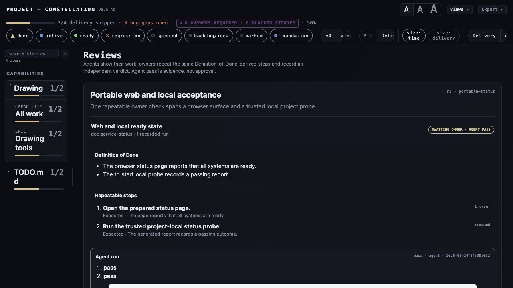
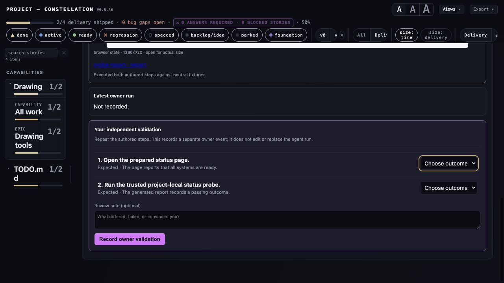

# Completion audit — generic review and evidence workflow

> Date: 2026-08-23
> Audited implementation: feature code through `95ff95b`, completion evidence through `ba468ef`
> Scope: G-001 objective and success conditions; G-002's separately disclosed 100k cold-start
> performance follow-up is not promoted into an enterprise-performance claim here.

## Conclusion

G-001 is implemented and merged to upstream `main`. The source contract, derived procedure,
agent execution, evidence bytes, owner repetition, and owner verdict are separate authorities; the
web/local host boundary is symbolic and project-owned; the served owner mutation is loopback-only;
and the generic runtime/fixtures contain no originating-project identity. The revalidation also
closed the initial worktree inventory's explicit second-pass requirement.

This conclusion needs revalidation if either of these conditions becomes true after publication:

1. the live IllTool review-capture lane adds a new generic Vizzer engine module after
   `a23cccc29b18`; or
2. the upstream branch is rebased or modified without rerunning the source/runtime identity,
   focused workflow, complete suite, and packaging gates below.

## Requirement-to-evidence matrix

| Requirement | Result | Direct evidence |
|---|---|---|
| Compare current IllTool state, every owner-named worktree, and recent product thinking | Achieved | The [worktree inventory](illtool-worktree-inventory-2026-08-23.md) records the initial thirteen-path scan and the fresh publication revalidation. The latter resolved current path existence/HEADs, read the detached DoD/capture/review contracts directly, and compared the live dirty upstream checkout file-by-file with the isolated branch. |
| Work around the live Claude ledger rather than duplicate it | Achieved | G-001 and the [migration matrix](capability-migration-matrix-2026-08-23.md) name the collision exclusions. The only newer IllTool commits are the explicitly excluded review screenshots/archive/application script; no IllTool record, verdict, screenshot, story, or lifecycle state was changed. |
| Incorporate reusable behavior behind project-neutral boundaries | Achieved | The migration matrix classifies every audited family as implemented, adapter-owned, or deliberately excluded host policy. Core additions use normalized source/detail/review/developer-graph contracts; optional perspectives and Developer Flow are off by default. |
| Preserve source, derived steps, agent run, evidence, owner run, and lifecycle as distinct facts | Achieved | `vizzer.review_contract` fingerprints the source-backed plan, validates an ordered complete step result, verifies evidence bytes, appends agent/owner events under revision CAS, binds an owner event to the latest agent event, and does not mutate lifecycle. `docs/review-workflows.md` documents the authorities. |
| Support web and local development projects | Achieved | `tests/test_review_host_fixtures.py` starts a real loopback web host, executes a trusted local Python probe, stores screenshot/report evidence, and records both agent events. The completion fixture combined both modes in one row and served the exact same steps to the owner. |
| Let an owner repeat the same steps and independently validate/reject | Achieved | The served Reviews route showed the exact two DoD-derived steps, latest agent run, 1280×720 evidence, report link, separate step-outcome controls, note, and owner append action. HTTP tests independently exercise a successful owner transaction plus stale revision, pre-agent, wrong-lineage, CLI-owner, HTTP-agent, origin, and CSRF rejection. |
| Identify source-of-truth and evidence schemas | Achieved | Schema-1 plan, event, ledger, adapter registry, object detail, and developer graph contracts are documented and parser-validated. A plan revision rotates to a new fingerprint epoch; historical events remain immutable. |
| Enforce security/privacy boundaries | Achieved for local v1 | Project-relative descriptor walks use `openat`/`O_NOFOLLOW` where available; plans, sources, ledgers, images, decoded pixels, state projection, and evidence delivery are bounded; raw commands and executable adapter fields are rejected; storage roots are contained/non-overlapping; evidence URLs are opaque and byte-reverified; loopback Host, same-origin/CSRF, `nosniff`, sandbox CSP, and same-origin resource policy are tested. Capture redaction and semantic screenshot quality remain declared host responsibilities because Vizzer cannot infer secrets or scenario truth from pixels. |
| Prove project agnosticism | Achieved | Unrelated web-application and data-pipeline graph fixtures plus neutral web/local review fixtures exercise the same contracts. Negative tests scan shipped runtime and fixtures for originating product names, paths, Apple/Xcode host assumptions, and personal identity. |
| Verify rendered/served behavior, offline packaging, and core independence | Achieved | Publication gate: **491 passed** in 64.59 seconds. `npm run build` passed; production audit reported **0 vulnerabilities**. Wheel/sdist built; the wheel installed with `--offline --no-deps`, declared no runtime requirements, and contained the optional assets/notices. Two deterministic zipapps had identical SHA-256 `6f542c912aaf1fc4fde2f64e127e42a7545bad855a5d11b77bfc90405da839df`. |

## Fresh neutral served exercise

The completion fixture used a source Markdown Definition of Done with two criteria. Its plan
fingerprint was `7fa602a9e3d4c72aa2edc5b8d592e4ea1636df1a71567daa5dc889fb6c8f91e9`.
The trusted host then:

1. served and checked a neutral web status page;
2. ran a neutral project-local status probe that reported `ready` with three checks;
3. attached a 1280×720 JPEG (`19,801` bytes,
   `7a570b3cdb183cd94032634071871923270cb37191b6f73e0a7a9b457e6b4ebf`);
4. attached the 121-byte JSON report
   (`3fe9ec5f5aa2cd3690366002cbdf9ab46e0edef03cf1336c8e3443706cb0d7c4`);
5. appended `agent-portable-1` at ledger revision 1; and
6. served both artifacts through validated opaque URLs.

The browser then rendered the authored DoD, the same ordered web/local steps, agent verdict,
full-width evidence link, `awaiting owner` state, and the independent owner controls. The agent did
not submit the owner form; backend transaction tests exercise that mutation without counterfeiting
this review receipt as a human decision.

Both receipts are 1280×720 JPEGs. Their SHA-256 values are respectively
`f924502b76509c906ca797aea1462f1b4a53ad20eeb0042d522e156b9896b3bb` and
`946302de07020076fa62b786894526e3779e0829b6d18f0b45a6e719397a88ce`. A complete wiki image scan
validated 11 artifacts and found zero media-type/filename-extension mismatches; nine older browser
receipts had carried JPEG bytes under `.png` names and were renamed rather than re-encoded.

## Residuals that are not hidden completion claims

- Remote multi-user identity is not part of local v1. Loopback possession is the owner boundary;
  binding elsewhere requires an authentication adapter and a new threat model.
- Capture adapters must prove that a screenshot depicts the intended scenario and must redact
  secrets/unrelated windows. Core verifies immutable, bounded, structurally valid bytes; it does
  not award semantic truth to pixels.
- Developer Flow's 100,000-object query boundary is correct and bounded, but its measured cold
  normalization/index cost remains too high for an “enterprise-performance-ready” label. G-002
  retains persisted/incremental indexing and adapter aggregation as an explicit performance
  follow-up.
- Ryder authorized publication after the fresh adversarial gate. Upstream `main` was fast-forwarded
  from `8ae6462` to `ba468ef` without force and the fetched and independently queried remote SHAs
  matched; this record follows that publication rather than pretending a branch push was a merge.
