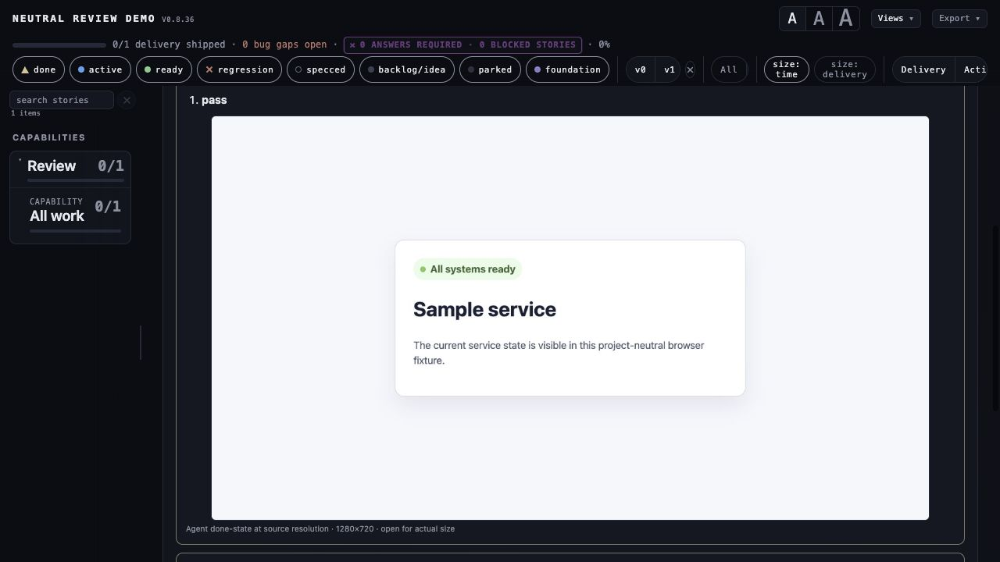

# Review service and owner-loop verification — 2026-08-23

## Automated verification

- `python3 -m compileall -q src tests/fixtures/review_local/status_probe.py`
- `git diff --check`
- Python 3.9 complete suite after the combined review/developer-flow attack pass — **453 passed,
  2 skipped in 89.94s**
- Python 3.9 focused review and developer-flow suite — **68 passed in 26.31s**
- `npm run build` — rebuilt the pinned, self-contained optional React/React Flow/ELK bundle.
- `npm audit --omit=dev` — **0 vulnerabilities**. The build workspace intentionally has no
  `npm test` script; its JavaScript contracts are executed by the Python-driven Node tests.
- Deterministic mixed-project constellation golden regenerated from the tested renderer and checked
  by `tests/test_cli.py::test_sync_render_check_archive`.

The generic host integration test starts a real loopback web server, verifies the ready-state page,
attaches the browser-captured JPEG evidence, executes a trusted project-local Python status probe,
attaches its JSON report, and records both as passing agent events. A separate negative test scans
the shipped review runtime and generic fixture text for originating-project names, paths, and host
assumptions.

## Served browser exercise

The generated constellation was served on loopback and exercised in the in-app browser:

1. The title bar exposed one 14/18/22-point segmented A control.
2. Selecting 22 produced `--sidebar-type-size: 22pt`; rail prose computed to `29.3333px` while a
   lifecycle chip remained `11px`.
3. The left separator responded to the keyboard and kept its CSS width and `aria-valuenow` in sync.
4. The Reviews route displayed the exact DoD, ordered expected results, latest agent evidence, and
   latest owner event.
5. Submitting the owner form advanced the fixture plan from revision 2 to revision 3 and the note
   reappeared from the persisted ledger.
6. A row without an agent run showed `awaiting agent` and did not expose an owner form.
7. The constellation gesture hint was found overlapping the Reviews route in the first screenshot;
   `#hint[hidden]` was fixed and rechecked as `display: none`.
8. Agent and owner runs now stack at full content width. A 1280×720 JPEG rendered inline at
   **918×516**, preserving its aspect ratio, with an explicit actual-size link. The earlier
   postage-stamp capture was removed from the review materials because evidence that cannot be
   visually judged is not useful evidence.
9. The owner verdict cites the exact latest agent event it validates; stale or pre-agent owner
   events are rejected.
10. Markdown criteria must occur in the authored Definition of Done/acceptance-test section, not
    merely somewhere else in the source file.

The browser target fixture captured during the same verification is
[`tests/fixtures/review_web/status.jpg`](../../../../tests/fixtures/review_web/status.jpg).

## Result

The verified slice is project-agnostic and dependency-free in core. Agent execution stays a host
responsibility behind declared adapter operations; Vizzer validates the plan, source fingerprint,
evidence, append-only run authority, served owner transaction, and current evidence availability.
